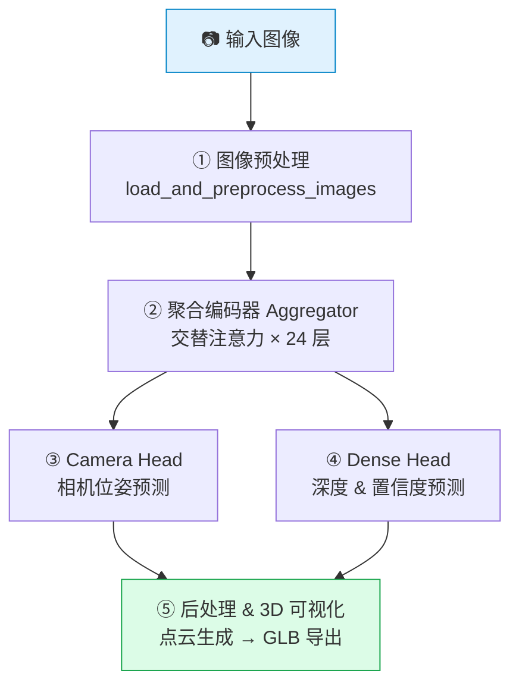

# VGGT-Ω 推理流程 (Pipeline)

## 概述

VGGT-Ω 是一个前馈式（feed-forward）的相机与深度重建模型，能够从一组图像或视频中**一次性**预测所有相机的位姿（extrinsics/intrinsics）和逐像素深度图，无需迭代优化。

整个推理流程分为 **5 个阶段**：



---

## ① 图像预处理

**入口**: `vggt_omega.utils.load_fn.load_and_preprocess_images()`

| 步骤 | 说明 |
|------|------|
| 加载图像 | 读取 RGB 图像，RGBA 自动合成白色背景 |
| 宽高比裁剪 | 中心裁剪极端宽高比，限制在 [0.5, 2.0] 范围内 |
| 缩放 | 两种模式：`balanced`（保持 token 总数 ≈ resolution²）或 `max_size`（最长边对齐到 resolution） |
| 对齐填充 | 若图像尺寸不一致，自动 padding 到统一尺寸 |
| 输出 | `Tensor [N, 3, H, W]`，值域 [0, 1] |

**关键参数**：
- `image_resolution`：默认 512，决定 patch token 数量
- `mode`：`balanced`（推荐，平衡精度与显存）/ `max_size`

---

## ② 聚合编码器 (Aggregator)

**入口**: `vggt_omega.models.aggregator.Aggregator`

这是 VGGT-Ω 的核心编码器，采用 **交替注意力（Alternating Attention）** 架构：

### Token 构成

每张图像包含三类 token：

| Token 类型 | 数量 | 作用 |
|-----------|------|------|
| Camera Token | 1 | 汇聚全局场景信息，用于相机位姿预测 |
| Register Token | 16 | 存储跨帧全局上下文 |
| Patch Token | H×W / 16² | 图像 patch 特征，用于稠密深度预测 |

### 交替注意力机制（24 层）

```
每一层包含两个子步骤：
  ┌─ Frame Block（帧内自注意力）：每张图独立做 self-attention + RoPE 位置编码
  └─ Inter-Frame Block（帧间注意力）：
       ├─ 大多数层 → Global Attention：所有帧的所有 token 拼接做全局 self-attention
       └─ 指定层 (2,6,9,14,20) → Register Attention：仅 camera+register token 跨帧交互
```

### Patch Embedding

使用 **DINOv2 Vision Transformer** 作为 patch 特征提取器：
- 预训练 DINOv2 backbone（24 层 ViT）
- 输出每个 16×16 patch 的 1024 维特征向量
- 使用 RoPE（旋转位置编码）注入空间位置信息

### 缓存输出

Aggregator 在指定层（第 4, 11, 17, 23 层）缓存中间特征，供下游 head 使用。  
输出维度：`[batch, num_frames, num_tokens, 2 × embed_dim]`（拼接 frame_tokens 和 inter-frame tokens）。

---

## ③ Camera Head — 相机位姿预测

**入口**: `vggt_omega.models.heads.camera_head.CameraHead`

从 Aggregator 最后一层的 camera + register tokens 中预测每帧相机的 9D 编码：

| 分量 | 维度 | 说明 |
|------|------|------|
| Translation | 3 | 相机平移向量 (tx, ty, tz) |
| Quaternion | 4 | 旋转四元数 (qw, qx, qy, qz) |
| FoV | 2 | 垂直和水平视场角 (fov_h, fov_w) |

### 处理流程

```
camera + register tokens (最后一层)
  → LayerNorm
  → 4 层 Self-Attention trunk（跨帧混合）
  → 取 camera token（第一个 token）
  → LayerNorm → MLP (1024→512→9)
  → 激活函数：ReLU(FoV) + 0.01 保证正值
  → 9D pose encoding
```

### 解码为相机矩阵

`vggt_omega.utils.pose_enc.encoding_to_camera()` 将 9D 编码解码为：
- **外参 (extrinsics)**：3×4 的 camera-from-world 矩阵（OpenCV 坐标系）
- **内参 (intrinsics)**：3×3 矩阵，主点位于图像中心

---

## ④ Dense Head — 深度 & 置信度预测

**入口**: `vggt_omega.models.heads.dense_head.DenseHead`

受 Depth-Anything-V2 启发的多尺度特征融合深度预测头：

### 多尺度特征提取

从 Aggregator 缓存的第 4, 11, 17, 23 层提取 patch tokens：

| 层 | 通道数 | 缩放倍率 | 作用 |
|----|--------|---------|------|
| 第 4 层 | 256 | 4× 上采样 | 细节特征 |
| 第 11 层 | 512 | 2× 上采样 | 中尺度特征 |
| 第 17 层 | 1024 | 1× | 语义特征 |
| 第 23 层 | 1024 | 0.5× 下采样 | 全局特征 |

### 特征融合（Scratch Network）

采用 **由粗到细** 的渐进式融合：
```
layer4 → refinenet4 → 上采样 → + layer3 → refinenet3 → 上采样 → + layer2 → refinenet2 → 上采样 → + layer1 → refinenet1
```

每个 `FeatureFusionBlock` 包含两个 `ResidualConvUnit`（3×3 卷积 + 残差连接）。

### 输出

- **Depth**: `exp(logits)` → 正数深度值，shape `[B, N, H, W, 1]`
- **Depth Confidence**: `1 + exp(logits)` → 置信度 ≥ 1.0，shape `[B, N, H, W]`

### 分块推理

为节省显存，DenseHead 支持 `frames_chunk_size` 参数，将帧分批处理（默认 8 帧/批）。

---

## ⑤ 后处理 & 3D 可视化

### 深度反投影

**入口**: `demo_gradio.py → unproject_depth_map_to_point_map()`

利用预测的相机内参和深度图，将每个像素反投影到 3D 世界坐标：

```python
# 像素坐标 → 相机坐标
X = (x - cx) / fx × depth
Y = (y - cy) / fy × depth
Z = depth

# 相机坐标 → 世界坐标
world_points = R^T × (camera_points - T)
```

### GLB 场景生成

**入口**: `visual_util.predictions_to_glb()`

将预测结果导出为 GLB（glTF Binary）3D 场景文件：

| 步骤 | 说明 |
|------|------|
| 置信度过滤 | 按百分位数阈值（默认 20%）丢弃低置信度点 |
| 深度边缘过滤 | 检测深度突变区域（相对跳变 > 3%），消除边缘伪影 |
| 背景过滤 | 可选过滤黑色/白色背景像素 |
| 天空过滤 | 可选使用 skyseg ONNX 模型分割并过滤天空区域 |
| 点数限制 | 均匀采样至 `max_points` 个点（默认 1,000,000） |
| 场景对齐 | 以第一帧相机为参考，应用 OpenGL 坐标系转换 |
| 相机可视化 | 用彩色锥体标记每个相机位姿（颜色来自 gist_rainbow colormap） |

---

## 完整数据流

```
输入图像路径列表
    │
    ▼
load_and_preprocess_images()  ──→  Tensor [N, 3, H, W]
    │
    ▼
VGGTOmega.forward(images)
    │
    ├── Aggregator
    │     │
    │     ├── DINOv2 Patch Embedding ──→ patch tokens [N×(H×W/256), 1024]
    │     ├── + camera_token + register_token
    │     └── 24 层交替注意力 ──→ cached outputs (层 4,11,17,23)
    │
    ├── Camera Head ──→ pose_enc [B, N, 9]
    │     └──→ encoding_to_camera() ──→ extrinsics [B, N, 3, 4]
    │                                   intrinsics [B, N, 3, 3]
    │
    ├── Dense Head ──→ depth [B, N, H, W, 1]
    │                   depth_conf [B, N, H, W]
    │
    └── (可选) Text Alignment Head ──→ text_alignment_embedding [B, 1024]
    │
    ▼
unproject_depth_map_to_point_map()  ──→  world_points [N, H, W, 3]
    │
    ▼
predictions_to_glb()  ──→  GLB 3D 场景文件
```

---

## 模型规格

| 参数 | 值 |
|------|-----|
| 模型规模 | ~1B 参数 |
| Patch Size | 16×16 |
| Embedding 维度 | 1024 |
| Aggregator 深度 | 24 层 |
| 注意力头数 | 16 |
| Register Token 数 | 16 |
| 相机编码维度 | 9D (3T + 4Q + 2FoV) |
| 可用 checkpoint | `VGGT-Omega-1B-512` (512px, 无文本对齐) |
| | `VGGT-Omega-1B-256-Text-Alignment` (256px, 含文本对齐) |

---

## 显存参考

在 NVIDIA A100 上，624×416 输入，`balanced` 模式：

| 输入帧数 | 1 | 10 | 25 | 50 | 100 | 200 | 300 | 400 | 500 |
|:--------:|:-:|:--:|:--:|:--:|:---:|:---:|:---:|:---:|:---:|
| **峰值显存 (GB)** | 6.02 | 6.67 | 7.80 | 9.66 | 13.37 | 20.82 | 28.26 | 35.71 | 43.15 |

---

## 项目文件结构

```
vggt-omega/
├── demo_gradio.py              # Gradio 交互式 Demo
├── visual_util.py              # GLB 场景导出 & 可视化工具
├── vggt_omega/
│   ├── __init__.py
│   ├── models/
│   │   ├── vggt_omega.py       # VGGTOmega 主模型（组合 Aggregator + Heads）
│   │   ├── aggregator.py       # 聚合编码器（交替注意力 + DINOv2 backbone）
│   │   ├── heads/
│   │   │   ├── camera_head.py  # 相机位姿预测头
│   │   │   ├── dense_head.py   # 深度 & 置信度预测头
│   │   │   └── text_alignment_head.py  # 文本对齐嵌入头
│   │   └── layers/             # 基础模块（Attention, FFN, RoPE, ViT 等）
│   └── utils/
│       ├── load_fn.py          # 图像加载与预处理
│       ├── pose_enc.py         # 相机编码/解码
│       ├── geometry.py         # 几何工具函数
│       └── rotation.py         # 旋转矩阵 ↔ 四元数转换
├── examples/                   # 示例视频
├── requirements.txt            # 核心依赖
└── requirements_demo.txt       # Demo 额外依赖
```
